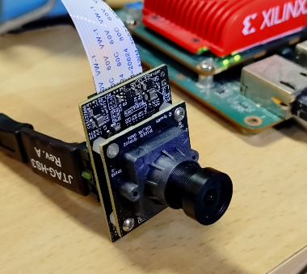

Japanese version is here: [README.md](README.md)

# Global-Shutter MIPI High-Speed Camera (PYTHON300 + Spartan-7)

## Overview

This repository contains the KiCad design data for the global-shutter MIPI high-speed camera introduced [here](https://rtc-lab.com/products/rtcl-cam-p3s7-mipi/).

It is a compact camera module for research and development, built with the onsemi [PYTHON300 image sensor](https://www.onsemi.com/products/sensors/image-sensors/python300) and the AMD (Xilinx) [Spartan-7 FPGA](https://www.amd.com/en/products/adaptive-socs-and-fpgas/fpga/spartan-7.html).

The sensor is specified as a VGA-class device and rated for up to 815 fps on the datasheet, and in our setup we have confirmed 320x320 capture at 1000 fps when connected to a [KV260](https://www.amd.com/en/products/system-on-modules/kria/k26/kv260-vision-starter-kit.html) or [Zybo Z7](https://digilent.com/shop/zybo-z7-zynq-7000-arm-fpga-soc-development-board/).

Sample videos and related information are also introduced [here](https://rtc-lab.com/products/rtcl-cam-p3s7-mipi/).

## Schematics

The schematics are as follows:

- [Image sensor daughterboard](sensor_python300/sensor_python300.pdf)
- [FPGA motherboard](mipi_spartan7/mipi_spartan7.pdf)

## Board Sales

We currently sell the manufactured boards on [BOOTH](https://rtc-lab.booth.pm/) and [BASE](https://rtcl.base.shop/).

For details, please see:

https://rtc-lab.com/products/rtcl-cam-p3s7-mipi/

## Related Software

At present, there is a project that sends data to the KV260 using a custom protocol.

- [Spartan-7 design](https://github.com/ryuz/rtcl-designs/tree/main/projects/rtcl_p3s7_mipi/rtcl_p3s7_mipi)
- [KV260 design](https://github.com/ryuz/rtcl-designs/tree/main/projects/kv260/kv260_rtcl_p3s7_hs)

We have also confirmed that it can be connected to ZYBO at reduced speed and may also be compatible with MIPI-CSI, but these projects are not yet prepared as formal repositories. Please look forward to future developments.

## Repository Structure

| Directory        | Description                                                |
|:-----------------|:-----------------------------------------------------------|
| mipi_spartan7    | Project for the motherboard with the Spartan-7 FPGA        |
| sensor_python300 | Project for the daughterboard with the PYTHON300 sensor    |
| sensor_mipi      | Combined panelized project for manufacturing the motherboard and daughterboard |

## Disclaimer

These design files are intended for prototyping and research/development experiments. The author assumes no responsibility for any damages arising from their use.

## License

These design files are provided under the [Creative Commons Attribution-NonCommercial 4.0 International License](https://creativecommons.org/licenses/by-nc/4.0/).

You are free to use the design for hobby or research/development purposes as long as you do not sell or distribute the manufactured boards without permission.

If you wish to manufacture and sell the board commercially, please contact the author to arrange a separate licensing agreement. You can reach out via the [contact form](https://rtc-lab.com/contact/).

## Author

Ryuji Fuchikami  
[Real-Time Computing Laboratory](https://rtc-lab.com/)
