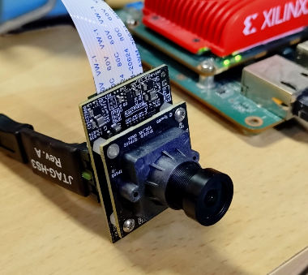

Japanese version is here: [README.md](README.md)

# Global-Shutter MIPI High-Speed Camera (PYTHON300 + Spartan-7)

## Overview

This repository provides the design data for a compact, R&D-oriented camera module built with the onsemi [PYTHON300 image sensor](https://www.onsemi.com/products/sensors/image-sensors/python300) and the AMD (Xilinx) [Spartan-7 FPGA](https://www.amd.com/en/products/adaptive-socs-and-fpgas/fpga/spartan-7.html).

The hardware was designed using KiCad.

Although the sensor is VGA-class on the datasheet and rated for up to 815 fps, we have achieved 1000 fps capture at 320×320 when connected to an [KV260](https://www.amd.com/en/products/system-on-modules/kria/k26/kv260-vision-starter-kit.html).

## Board Sales

We sell manufactured boards on [BOOTH](https://rtc-lab.booth.pm/).

- [Monochrome version](https://rtc-lab.booth.pm/items/7427869)
- [Color version](https://rtc-lab.booth.pm/items/7428802)

## Related Software

Currently, there is a project that sends data to the KV260 using a custom specification.

- [Spartan-7 Design](https://github.com/ryuz/jelly/tree/master/projects/rtcl_p3s7/rtcl_p3s7_hs)
- [KV260 Design](https://github.com/ryuz/jelly/tree/master/projects/kv260/kv260_rtcl_p3s7_hs)

We have also confirmed that it's possible to connect to ZYBO at reduced speeds and comply with MIPI-CSI standards, but these projects are not yet prepared. Please look forward to future developments.

## Repository Structure

| Directory        | Description                                                |
|:-----------------|:-----------------------------------------------------------|
| mipi_spartan7    | Project for the baseboard carrying the Spartan-7 FPGA      |
| sensor_python300 | Project for the daughterboard carrying the PYTHON300 sensor |
| sensor_mipi      | Combined panelized project for manufacturing base and daughter boards |

## Disclaimer

These design files are provided for prototyping and research/development experiments. The author assumes no responsibility or liability for any damages arising from their use.

## License

This work is licensed under the [Creative Commons Attribution-NonCommercial 4.0 International (CC BY-NC 4.0)](https://creativecommons.org/licenses/by-nc/4.0/).

You may freely use the design for hobby or research purposes, as long as you do not sell or distribute the manufactured boards without permission.

If you wish to manufacture and sell this design commercially, please contact the author to arrange a separate license agreement. You can reach us via the [contact form](https://rtc-lab.com/contact/).

## Author

Ryuji Fuchikami  
[Real-Time Computing Laboratory](https://rtc-lab.com/)
